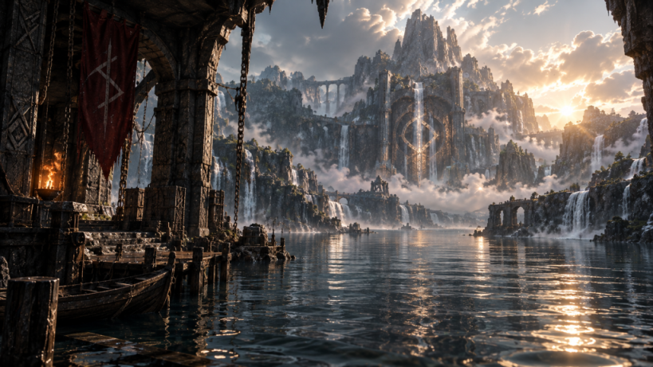

# The lore of Kerdoios

**Find the advantage.**

This is the canonical story, cosmology, and visual world for Kerdoios. The plugin README retells the short form. This file is the source.

  

## Premise

Kerdoios (Κερδῷος) is Hermes' cult epithet *of gain* — gain as advantage, not as scraping.

Lucius Annaeus Cornutus, *Greek Theology* §25: Hermes is called Kerdoios because reason alone is the cause of *true* gain. The plugin is named for that epithet. It is not named for credits, coupons, or a billing sidecar.

The world already has more computational power than any one river — any one provider, GPU, or paid endpoint — can show at a glance. The power is not missing. It is scattered: free quotas, idle local wheels, promotional credits, rate-limited inference, cheap models, expensive frontier gates. Most systems treat those as incompatible scraps. Kerdoios notices them, connects them, and allots a **portfolio** when that is the advantageous route.

It does not create the water. It does not execute the work. Hermes still orchestrates, verifies, and retries. Kerdoios only answers: given this work, these offers, and these constraints, **what portfolio should run?**

## The Rivers

The Rivers are every current that can be discovered, filtered, and combined.

They are not one ocean owned by a single power. They are thousands of insignificant flows: a spring that resets at midnight, a private mill on a local wheel, a borrowed canal that expires at the end of the month, a locked reservoir that opens only if you pay the gate. Alone, none of them is enough. Together, for a night, they can be.

Kerdoios walked the mountains looking for a greater source and did not find one. He reopened forgotten aqueducts, redirected abandoned streams, restored old wells, borrowed excess flow, and released reservoirs only when the work actually required them.

That is the whole method.

## The shrine

The shrine sits where the waterways meet the mountain. Foreground water. A waterwheel. Stone channels. A gate carved with the convergence glyph. On the inner wall:

**POWER WAS NEVER SCARCE. ONLY SCATTERED.**

The dock below is working architecture, not a temple for tourists. Boats. Chains. A red banner with the same glyph. Torchlight on wet stone. The mountain in the distance is the same place seen from the water.

The two stills in `docs/art/` are original art for this project:

- `art/shrine-the-scattered-rivers.png` — the mountain gate from the water, inscription and glyph on the stone, waterwheel to the side.
- `art/shrine-from-the-dock.png` — the approach: dock, boats, red banner, the shrine across the lake.

## The First Convergence

### I. The city and the one river

A city once needed more power than any known river could give. The obvious answer was a greater source: a bigger river, a deeper well, a sea of one's own. There was no such source. The landscape was already wet. The water was just in the wrong places, in the wrong sizes, at the wrong times.

### II. The walk

Kerdoios found no greater source. He walked into the mountains.

He did not invent water. He read the ground. Forgotten aqueducts still held a channel. Abandoned streams still ran if you cleared the stone. Old wells still answered. Excess flow sat unused behind other people's gates. Reservoirs existed that no one wanted to open until the work was real.

### III. The gathering

For days, thousands of insignificant currents moved across the landscape. None of them looked like an ocean. That was the point. A planner who will only accept a sea will wait forever. A planner who can allot small springs, private wheels, and paid gates together can work tonight.

### IV. The night

Then the water rose. Streams became rivers. Rivers became a torrent.

For one night the city possessed **the strength of an ocean without owning a single sea.**

That night is called the First Convergence.

### V. After

The shrine marks the meeting, not the ownership. The glyph is the diagram of that night: many channels, one cut, no single sea. The Fates were already there. They did not arrive with the flood.

## Metaphor

| Lore | Compute |
| --- | --- |
| The Rivers | Heterogeneous compute that can be discovered: free quota, local inference, credits, cheap models, frontier endpoints |
| A spring that resets | Perishable free quota |
| A private waterwheel | Local inference (`local_only`, on-device, `:11434` / `:1234`) |
| Borrowed excess flow | Promotional credits, leftover capacity |
| Reservoir gates | Paid overflow; expensive frontier models |
| The walk into the mountains | Inventory: notice what others overlook |
| Hard rock that will not yield | Ananke: privacy, context, tools — price cannot buy a pass |
| The portion | Lachesis / Kerdoios: the portfolio of N workers |
| The cut | Atropos: budget and quota stop; the plan must not continue after the portion is spent |
| The work itself | Clotho / Hermes: create, execute, verify, retry |
| The First Convergence | A portfolio that is enough **together** without owning one provider |
| The shrine | This plugin's brand: the meeting place, not a second gateway |
| The city | The workload that needed more than one river |

Small springs, private waterwheels, and expensive reservoir gates are the same diagram: free quota, local inference, and paid overflow. Kerdoios allots the portion. Hermes spends it. The budget is the cut.

## The Fates (already in the code)

The plugin encodes a cosmology that was named before this file existed. Do not rename the product after a Fate. Do not invent extra gods.

| Name | Role among the gods | In Kerdoios |
| --- | --- | --- |
| **Clotho** (spin) | Spins the thread | **Hermes**: it creates the work, executes, verifies, retries |
| **Kerdoios / Lachesis** (measure) | Measures the portion | **This plugin**: allots the scarce thread — tokens, quota, GPU-hours, expiring credits — into an `ExecutionPlan` |
| **Atropos** (cut) | Cuts the thread | Budget / quota stop: `maximum_cost`, remaining free quota, the plan must not continue after the portion is spent |
| **Ananke** (necessity) | What cannot be bargained | Hard-filter: context, tools, `local_only`. Price cannot buy a pass |

Lachesis is the *function* (measure the portion). Kerdoios is the *name*. The code path is inventory → hard-filter (Ananke) → effective cost and perishable quota → Pareto set → portfolio of N workers → `ExecutionPlan`. Hermes executes. Kerdoios does not.

Modes today are how the portion is measured, not new mythic beings: `FREE`, `CHEAP`, `BALANCED`, `FAST`, `MAX`, `SCALE`, `PRIVATE`. Cost is one dimension of advantage. Depending on the task, the advantageous route might optimize for cost, capability, latency, throughput, privacy, reliability, available capacity, or some combination.

## Philosophy

1. **Advantage, not profit-max.** Cornutus: reason is the cause of true gain. A cheap plan that fails the work is not gain. A private plan that leaks is not gain. A fast plan that blows the cut is not gain.
2. **Portfolio, not a single endpoint.** Kerdoios is not an LLM router. It builds an execution portfolio.
3. **Do not create the water.** Do not grow a second LLM gateway. Commodity routing belongs upstream (LiteLLM). Kerdoios notices, filters, allots.
4. **Scattered is the default.** Missing, `None`, or default-0 catalog prices are unknown, not free. A zero in someone else's table is not a spring.
5. **The cut is real.** Atropos is not a metaphor you can skip in software. When the portion is spent, the plan stops.
6. **Ananke is not for sale.** `local_only` stays local. Context and tools are gates, not suggestions.

## Phrases

These are canonical. Prefer them to new slogans.

- **Find the advantage.**
- **POWER WAS NEVER SCARCE. ONLY SCATTERED.**
- **The rivers are compute.**
- **The strength of an ocean without owning a single sea.**
- **The First Convergence.**
- **Kerdoios allots the portion. Hermes spends it. The budget is the cut.**
- **Hermes executes. Kerdoios does not.**
- **It does not create the water.**
- **Small springs, private waterwheels, and expensive reservoir gates.**

## Visual world

High-end shrine stills. Stone, water, mist, working machinery.

- Always water in the foreground or the approach.
- Mountain architecture where many falls meet a gate — not a generic castle, not a generic temple.
- A waterwheel is a private mill: local power, visible, owned, limited.
- Red banners on the dock. Torchlight. Boats. Chains. Wet stone.
- Golden hour or storm-light; the air is wet.
- The inscription is carved, not typeset in the sky.
- The glyph is stone or cloth, never a UI icon slapped on the landscape.

Original stills for this project live in `docs/art/`. Do not replace them with another franchise's screenshots, concept-art rips, or a screenshot of a prompt.

## The glyph

The convergence glyph is a ring where several channels meet. Crossing strokes inside a circle: many currents, one cut, no single sea.

It is carved on the mountain gate and flown on the dock banner. It marks a meeting of flows, not ownership of an ocean. Use it as a stone or cloth mark. Do not turn it into a provider logo or a routing-flowchart mascot.

## Name: keep, and keep rejected

| Name | Why it fits | Why not |
| --- | --- | --- |
| **Kerdoios** | Hermes' own cult epithet for advantageous exchange. Short, unique, on-brand. Cornutus is the citation. | Sounds like "profit" until you read Cornutus. That is a teaching problem, not a rename. |
| Lachesis | The Fate who *measures the portion* — the actual divine function. Keep as cosmology. | **Rejected as the product id.** Collides with Fantom's Lachesis consensus. |
| Demiurge | Plato's craftsman who orders given matter into a cosmos. Closest philosophical cousin. | **Rejected.** Gnostic baggage (false creator). |
| Metis | Cunning stewardship of what you already have. | **Rejected.** Crowded name (protocols, NASA, companies). |
| hermes-cost-optimizer | Accurate | **Rejected.** Sounds like a billing sidecar. Forgettable. |

Do not resurrect a rejected product name. Clotho, Lachesis, Atropos, and Ananke stay as the Fates the code already encodes. They are not alternative titles for the repository.

## Tone

Mythic, specific, short. Cornutus is allowed. Purple fog is not.

Write as if the shrine is a working mill at the meeting of rivers: wet stone, a real cut, a city that needed power. Then say the mapping in one line. Do not invent shipped features to decorate the myth. Do not retell `AGENTS.md`. Do not add a second process file.

Workers open PRs. They never merge `main`.
